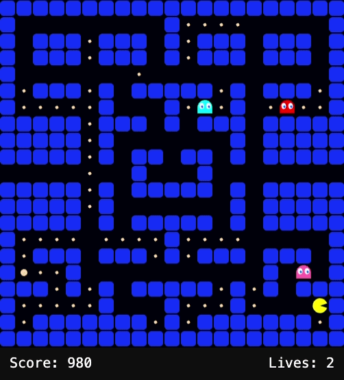
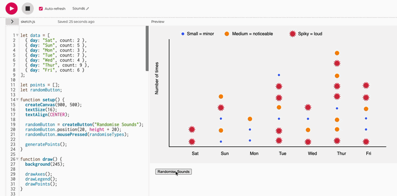
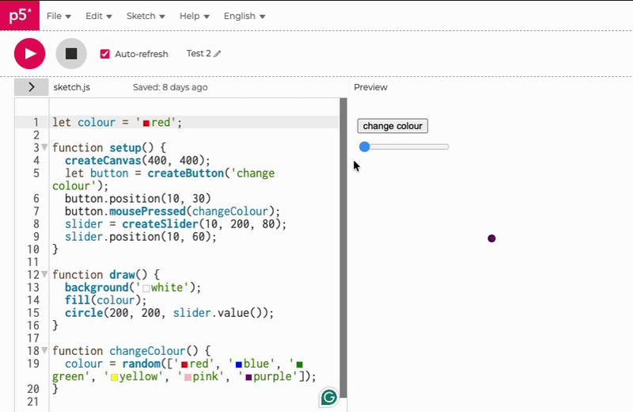

# Week 02

[← Back to Home](../index.md)

## Documentation 

## Overview

This week focused on translating my hand-drawn data portrait into an interactive p5.js sketch. Building on Experiment 1, I explored how interaction could shift the experience of my data from something static and observational into something dynamic and explorable.

Using the class materials from the DES240 slides, I learned how p5.js enables designers to create interactive visualisations using code, with elements such as shapes, motion, and user input. This allowed me to reinterpret my data drawing through a digital and interactive medium.

## What Data and Visual Aspects I Chose to Work With

From my original data drawing, I chose to focus on:

- The number of sudden sounds per day
- The type/intensity of sound (minor, noticeable, loud)
- The distribution across the week

I selected these because they were the clearest and most structured parts of my data. The tally-based system translated well into code, while the variation in circle size and texture became a key visual element in the digital version.

I did not attempt to replicate the entire drawing exactly. Instead, I prioritised elements that could benefit from interaction, such as comparison, movement, and user control.

## How I Designed the Interactive Visualisation

Based on what was introduced in class, I used p5.js to build a sketch that runs in the browser and continuously updates through the `draw()` function. This allowed the visualisation to feel active rather than static.

I incorporated interactive elements such as:

- Hover interactions to reveal information about each data point  
- Click interactions to reshuffle or regenerate the layout  
- Keyboard or toggle controls to show/hide labels or change behaviour  

These choices were influenced by the idea that digital interaction can act as an equivalent to physical interaction (e.g. tokens, threads, or movement).

## What Interaction Adds

Interaction allowed the data to be explored in ways that were not possible in the hand-drawn version.

Through interaction, a viewer can:

- Focus on individual data points  
- Compare different days more clearly  
- Reveal additional information only when needed  
- Experience the data as something dynamic rather than fixed  

The hand-drawn version communicates atmosphere and personal experience, while the interactive version introduces **exploration and control**. This changes the role of the viewer from passive observer to active participant.

## Process

My process followed a progression from analogue to digital:

1. Reviewed my Experiment 1 drawing  
2. Identified key data variables (frequency and intensity)  
3. Translated this into a structured format for coding  
4. Built the base sketch using p5.js  
5. Added interactivity and refined behaviour  
6. Tested and adjusted based on usability  

The class slides helped me understand how the `setup()` function initializes the sketch, while the `draw()` function continuously runs the program.

## Vibe Coding and Tools Used

I used p5.js as the primary tool for this experiment. In addition to the class content, I used vibe coding to explore ideas beyond what was demonstrated.

Specifically, I prompted ChatGPT to generate an **interactive Pac-Man game**, which helped me understand:

- How interaction logic works in real-time systems  
- How movement and user input can be structured  
- How more complex behaviours can be built through code  

This process showed me that AI-generated code is useful for exploration, but still requires:

- Testing  
- Modification  
- Understanding  

It helped me become more confident in experimenting with code rather than relying only on predefined examples.

## Challenges

Some of the key challenges included:

- Translating a loose, hand-drawn visual into structured code  
- Deciding what to simplify or remove  
- Maintaining a sense of “human” quality in a digital format  
- Balancing clarity with expressiveness  

These challenges made me more aware of the differences between analogue and digital design processes.

## Reflection

This experiment highlighted the difference between **representation and interaction**.

My original data drawing captured a personal and reflective experience of sound interruptions. The p5.js version, however, allowed the data to be explored, manipulated, and experienced over time.

I found that interaction adds a layer of engagement, but it can also risk making the work feel more technical and less personal. This made me think about how to maintain a balance between **data, design, and experience**.

## What I Would Develop Further

With more time, I would:

- Refine the visual style to feel more hand-drawn and less rigid  
- Introduce more meaningful controls (e.g. filtering by intensity)  
- Test the sketch with users and refine based on feedback  

## Final Thought

This week helped me understand that designing with data is not just about visualising information, but about shaping how people interact with and experience that information.

## Images & Media

`*PacMan Game through Vibe Coding*`

`*Sounds interactive graph in p5.js*`

`*Adding two interactions*`
