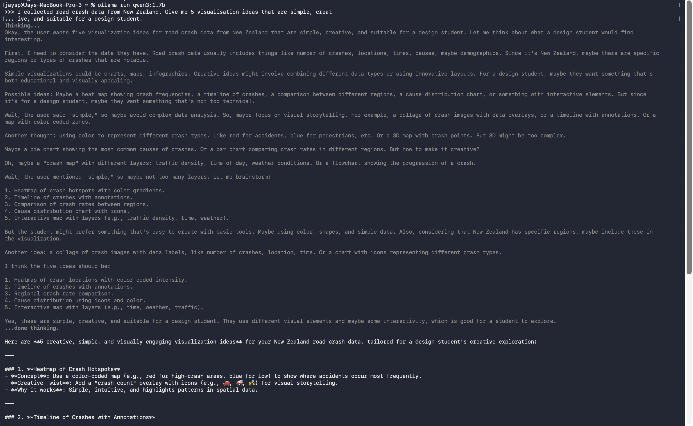
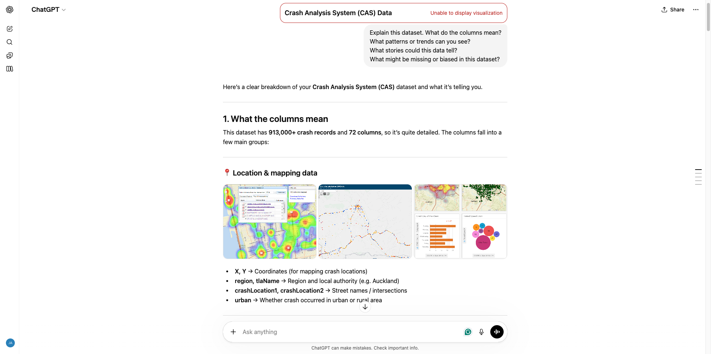
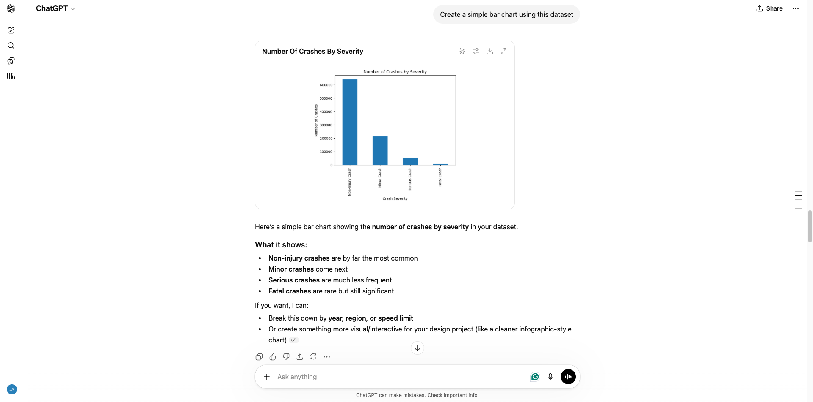
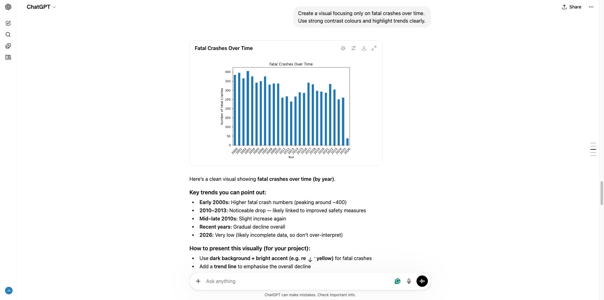
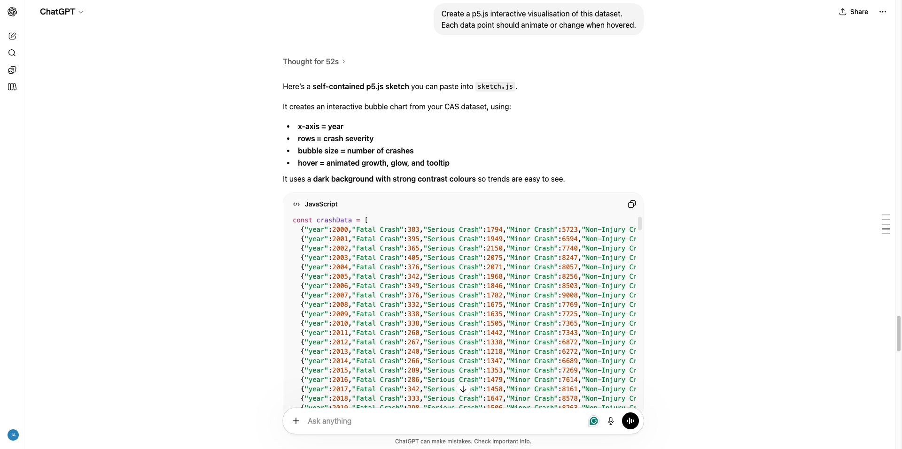

# Week 04

[← Back to Home](../index.md)

## Documentation 

## Overview

This week explored artificial intelligence as a design tool, combining both practical experimentation and critical reflection. The process involved using AI to interpret and visualise a dataset from Aotearoa New Zealand, while also engaging with key ideas from the lecture, including “vibe coding,” ethical AI use, and data sovereignty.

## Dataset Selection

I selected a dataset on road crash statistics in New Zealand from the government open data catalogue. I chose this dataset because it relates to real-world issues that affect everyday life, particularly safety and behaviour on roads. The dataset is structured with clear numerical values, making it suitable for visualisation. It also raises questions about what is recorded, what is missing, and how data reflects reality.

## Understanding the Data with AI

I uploaded the dataset into a cloud-based AI tool and used prompts to understand its structure and meaning. AI helped explain column definitions, patterns, and trends efficiently.

Prompts used:

* “Explain what each column represents”
* “What trends are visible in this dataset?”
* “What stories could this data tell?”
* “What biases or gaps might exist?”

While AI was useful for summarising the dataset, it lacked deeper contextual understanding. It did not fully account for how the data was collected, potential biases, or social and cultural factors. This reinforced the idea that AI outputs need to be critically evaluated rather than accepted as accurate.

## Design Process and Iterations

### Version 1 - AI Default Output

The initial output was a basic bar chart with standard formatting and minimal design consideration. This reflected how AI tends to default to generic and safe visualisations.

### Version 2 - Directed Visualisation

I refined the output by providing more specific instructions, such as focusing on fatal crashes and improving contrast. This resulted in a clearer and more intentional design, showing that stronger outcomes depend on how well the AI is directed.

### Version 3 - Interactive p5.js Visualisation

I then used AI to generate a p5.js sketch that introduced interactivity through hover effects and animation. This allowed users to explore the data rather than passively view it, making it the most engaging version.

## Vibe Coding and Iteration

This process aligns with the concept of “vibe coding” introduced in the lecture, where software is created by describing intentions in natural language and refining outputs iteratively .

Rather than coding everything manually, I:

* Described what I wanted the visualisation to do
* Reviewed the generated code
* Tested and refined outputs
* Added features step by step

This approach made coding more accessible, but still required understanding and control. It showed that AI supports the process, but the designer remains responsible for shaping the outcome.

## Local vs Cloud AI

The lecture also highlighted the difference between local and cloud-based AI tools .

* Cloud AI (e.g. ChatGPT):
    * More powerful and capable
    * Data is sent to external servers

* Local AI (e.g. Ollama):
    * Runs on your own device
    * Greater privacy, but less capable

Although I primarily used cloud AI, this comparison made me more aware of where my data goes and the trade-offs between performance and privacy.

## Ethical Considerations and Data Sovereignty

The lecture emphasised that AI and datasets are not neutral.

AI systems:

* may be trained on data without consent
* can contain embedded biases
* reflect the perspectives of those who created them

This connects to the idea of data sovereignty, particularly Māori data sovereignty, which highlights that data should be controlled by the communities it represents. Māori data includes cultural, environmental, and organisational information, and should be handled with care and respect.

This perspective challenged my assumption that all data is freely available to use, and made me more aware of ethical responsibility in design.

## Critical Reflection

AI tended to:

* Default to simple and generic outputs
* Assume a broad, neutral audience
* Prioritise clarity over creativity

I had to:

* Guide visual and design decisions
* Refine outputs through multiple prompts
* Question assumptions made by the AI

The interactive p5.js version was the most effective, as it allowed engagement and exploration. This demonstrated that meaningful design outcomes require active direction rather than passive use of AI.

The lecture also raised broader concerns about AI as an extractive technology that prioritises efficiency and data collection over deeper, relational understanding. This made me reflect on how AI could be used more responsibly in design, rather than simply for convenience.

## What I Would Develop Further

With more time, I would:

* Integrate the full dataset into the p5.js visualisation
* Explore more experimental and non-traditional formats
* Develop stronger narrative storytelling within the data

## Reflection on AI as a Design Tool

This week introduced the idea of “vibe coding,” where code is generated by describing what you want in natural language. Instead of writing everything manually, I used AI to produce visualisations and p5.js code, then refined it through iteration. This process involved clearly describing outcomes, testing results, and adjusting prompts to improve the output.

AI often defaulted to simple and generic solutions, such as basic charts and standard layouts. This meant I had to actively guide the process to achieve more meaningful and visually engaging results. It showed that AI is not a replacement for design thinking, but a tool that requires direction and critical input.

There are also important ethical considerations when working with AI. The datasets used may contain biases or exclude certain perspectives, and AI systems are often trained on data without clear consent. This raises questions about authorship, ownership, and responsibility.

The concept of data sovereignty, particularly Māori data sovereignty, further challenged my thinking. It highlights that data is not neutral, and that communities should have control over how their data is used and represented.

Comparing local and cloud-based AI also revealed trade-offs. Cloud tools like ChatGPT are more powerful but require data to be sent to external servers, while local tools like Ollama prioritise privacy but are more limited. This made me more aware of where my data goes when using AI tools.

Overall, this experience showed that AI can support creative workflows, but meaningful outcomes depend on how well the designer guides, questions, and refines the process.

## Images & Media

*Discovering Ollama*

*Uploading CAS Data file into ChatGPT*

*Prompt to create a graph*

*Prompt to create a better graph*

*Prompt to make a p5.js code*

*p5.js code in action*
