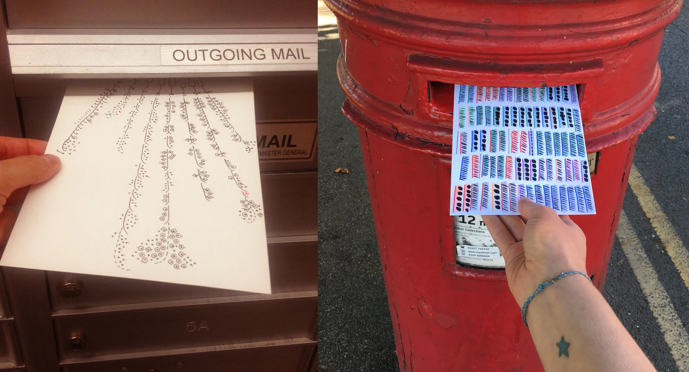
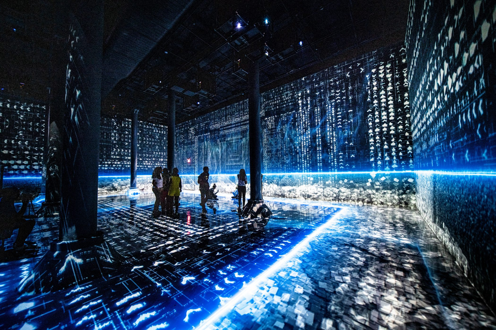
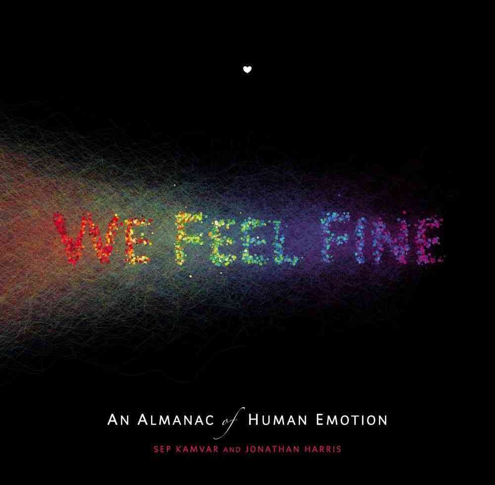
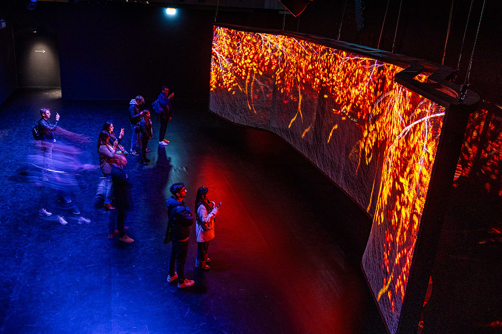
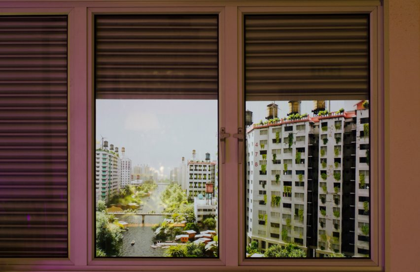
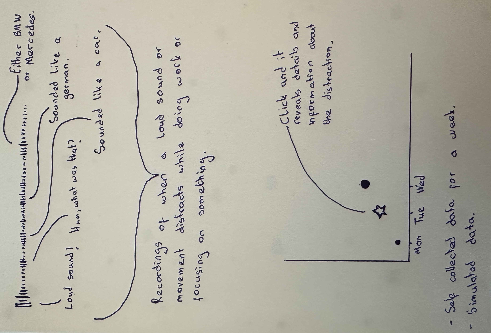

# Week 06

[← Back to Home](../index.md)

## Documentation 

# Week 6 - Making Journal

## Proposal Consultation Feedback

The feedback from my proposal consultation acknowledged that I offered clear, thoughtful responses and engaged meaningfully in the discussion. The area identified for improvement was demonstrating a stronger understanding of my chosen data source and how it connects to the ideas underpinning my proposal. For the Studio Consultation in week 12, I need to prepare for a more focused discussion on my data source and the conceptual ideas driving the development of the work.

This feedback was useful. Looking back at the consultation, I was confident talking about the visual and interactive direction of the project, but I could have been more specific about where the data comes from, how it is structured, and why that matters conceptually. The distinction between self-collected data and simulated data is something I need to articulate more clearly going forward. This week's activities directly address that gap.

## 1. Data Exploration

### What the data source is and where it comes from

The data for this project is self-collected and simulated. The primary source is personal observation. I recorded instances of sudden sounds and loud vehicles throughout my day using a tally-based system across one week. Each event was noted in real time, categorised loosely by perceived intensity: minor, noticeable, or loud. This method was introduced in Experiment 1 and forms the foundation of the dataset.

Because the dataset is small and limited to a single week of one person's experience, I am extending it through simulation. Simulated data follows the same structure as the real data but is generated to explore how the system might behave across a larger timeframe or different environments. This supports the speculative dimension of the project, a future scenario in which attention is continuously monitored and quantified.

### What the data contains and how it is structured

The dataset contains three core fields for each recorded event:

- **Day** - which day of the week the event occurred
- **Type** - the intensity category: minor, noticeable, or loud
- **Thought** - a short spoken or written note capturing the internal response at the moment of interruption (e.g. "what was that?", "I lost focus", "should I check?")

In its current form the data is structured as a flat list of 36 events across seven days (Sat–Fri), with counts ranging from 2 events on Saturday to 9 on Thursday. The thought field was added following feedback from the proposal consultation, which suggested that capturing the internal cognitive response, not just the external sound event, would significantly strengthen the project's connection to data humanism.

The data can be represented in a simple table format:

| Day | Count | Type distribution     |
|-----|-------|-----------------------|
| Sat | 2     | 2 minor               |
| Sun | 5     | 3 minor, 1 noticeable, 1 loud |
| Mon | 3     | 2 minor, 1 noticeable |
| Tue | 7     | 3 minor, 2 noticeable, 2 loud |
| Wed | 4     | 2 minor, 2 noticeable |
| Thu | 9     | 4 minor, 3 noticeable, 2 loud |
| Fri | 6     | 3 minor, 2 noticeable, 1 loud |

### Limitations, biases, and gaps

The most significant limitation is subjectivity. The categories (minor, noticeable, loud) are based entirely on my personal perception in the moment. The same sound could be classified differently on a different day, in a different mood, or by a different person. This makes the dataset non-replicable and inherently biased toward my own experience and environment.

There are also recording gaps, moments where a sound occurred but was not captured because my attention had already drifted, or because I was away from my notebook. These absences are themselves meaningful: they reflect the very thing the project is about. Missed data points are not errors but evidence of interrupted attention.

The dataset is also very small in scale. Seven days, one person, one environment. For the simulated extension of the data, I will need to make assumptions about distribution and frequency that may not reflect real-world diversity. This is a limitation, but it also reinforces the project's core argument that data systems built on small, partial, or biased inputs still produce outputs that are treated as objective truth.

These limitations are not being treated as problems to fix. They are being carried forward as part of the concept.

## 2. Visual Research and Precedent Study

### 1. Dear Data - Giorgia Lupi & Stefanie Posavec

*Dear Data* is a year-long project in which two designers mailed each other hand-drawn data postcards every week, visualising personal and subjective experiences.

- I am drawn to the handmade quality and the way it treats imperfection and incompleteness as part of the data rather than errors to be corrected.
- I want to carry forward the idea of building a personal visual language, one that communicates experience rather than just statistics.
- This strongly reinforces my direction, especially the use of qualitative data and the focus on subjective, lived experience.

### 2. Refik Anadol - Machine Hallucinations

Refik Anadol uses large-scale data sets and machine learning to create immersive, generative visual experiences where data becomes a living field rather than a static representation.

- I am drawn to the way data is treated as material, something that flows, drifts, and takes on organic form rather than sitting in a chart.
- I want to carry forward the idea of the canvas as a living environment where data elements exist in constant motion.
- This reinforces the visual direction of my interactive sketch, where 36 sound events drift organically across the screen as breathing ring forms.

### 3. Jonathan Harris & Sep Kamvar - We Feel Fine

*We Feel Fine* harvests emotional sentences from blogs across the internet and presents them as a living, interactive particle field, each particle a real person's expressed feeling.

- I am drawn to the way subjective, hard-to-quantify data (feelings, internal states, emotional responses) is treated as valid and worthy of visualisation rather than excluded for being unscientific.
- I want to carry forward the idea of internal thought as data, something that can be collected, represented, and made explorable through interaction.
- This directly reinforces my decision to add thought recordings to my dataset, treating the cognitive response to interruption as data rather than just context around it.

### 4. Domestic Data - Data Cuisine (Studio Bertram Niessen)

*Data Cuisine* translates statistical datasets into food, turning abstract numbers into sensory, tangible experiences. Each dish encodes a different variable through ingredient, texture, and taste.

- I am drawn to the idea of translating invisible or abstract data into something physical and experienced through the body, not just the eyes.
- I want to carry forward the principle that data representation does not have to be visual, it can be spatial, tactile, or sensory.
- This reinforces my interest in the 3D print direction and the idea that the physical piece should communicate through form and touch, not just information.

### 5. Superflux - Mitigation of Shock

*Mitigation of Shock* by Superflux is a speculative design installation imagining a near-future household adapting to climate crisis. It uses real and simulated data to construct a believable, critical future scenario.

- I am drawn to the way it blends real and speculative data to explore what a future system might look and feel like, making the invisible, plausible future tangible.
- I want to carry forward the use of a future scenario as a conceptual anchor, where the data is not just descriptive but provocative.
- This strongly reinforces the speculative dimension of my proposal, a future where attention is continuously tracked, quantified, and evaluated.

### Summary Reflection

Across these five references a consistent theme emerges: data as experience. Whether hand-drawn postcards, generative particle fields, personal annual reports, or speculative installations, each work moves beyond display toward something felt. The visual research has reinforced my focus on the interactive screen-based piece as the primary output, a field where data drifts, responds, and reveals thought over time.

## 3. Project Planning and Skills Roadmap

### 3.1 What do I need to make?

The final artefact is a full-screen interactive visualisation built in p5.js. The canvas presents 36 sound events as organic ring forms drifting continuously across a dark field. Each ring's visual character encodes the type of interruption, minor events are single small rings, noticeable events are two concentric rings, and loud events are three stacked rings of increasing height and visual weight.

The viewer's mouse represents their attention. Moving across the canvas causes nearby rings to resonate and pulse. Clicking a ring releases a thought fragment, a short italic phrase that drifts outward along a bezier curve before fading. The piece does not explain itself with labels or axes. The interaction and the motion communicate the concept: attention is not interrupted, it is redirected.

The piece is intended for display on a screen in the week 12 showcase, running continuously without instruction. It should be legible as an experience without requiring the viewer to read anything first.

*P5.js visualisation concept*

### 3.2 What do I need to learn?

1. **Refining p5.js interaction:** improving the responsiveness of the hover and click behaviour, and making the animation feel more intentional and less arbitrary. This is the highest priority because the interaction is central to the experience.

2. **Sound integration in p5.js:** adding the ability to play short audio clips (voice recordings) when an event is clicked. This ties the thought field directly to a real recorded voice, making the data more personal and the interaction more affecting. I need to learn how to use the p5.sound library to load and trigger audio.

3. **Simulating and structuring extended data:** I need to expand the dataset beyond one week using simulation, and structure it as a JSON array that can be cleanly loaded and iterated in p5.js. This also means deciding how simulated data is distinguished from real data within the piece.

4. **Strengthening the conceptual connection between data and form:** being able to clearly articulate, in conversation and in writing, exactly how the visual and physical forms encode the data. This is the gap identified in the consultation feedback.

### 3.3 What are my next steps?

My immediate priority is responding to the consultation feedback directly. I will write a clearer account of my data source, how events are categorised, how the thought field is recorded, and why subjectivity in the dataset is treated as meaningful rather than a limitation to overcome. 
 
In parallel, I will continue developing the interactive sketch with a focus on the quality of the interaction. I plan to show the piece to at least one person outside the course and observe how they engage with it, whether they understand what to do, whether the concept reads without explanation, and whether the experience communicates something about attention and disruption.
 
I will also begin working on sound integration so that clicking a ring plays a short recorded voice note. This will require recording a set of clips and learning how to load and trigger them using p5.sound. This step moves the project from a visual data piece toward something more immersive and personal, which better reflects the core concept.
