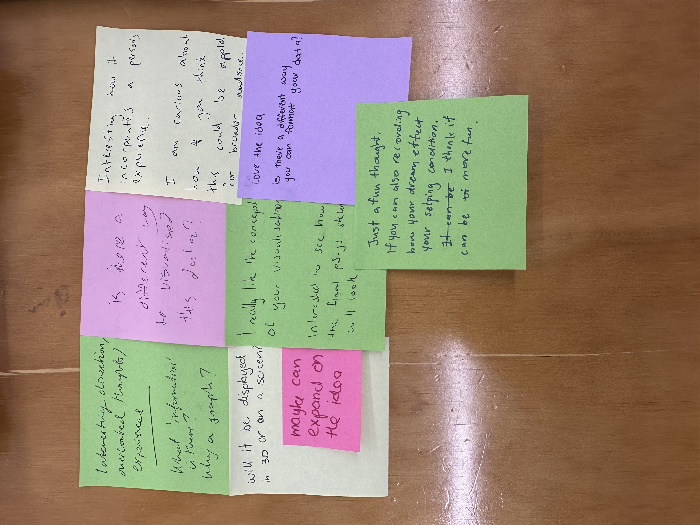
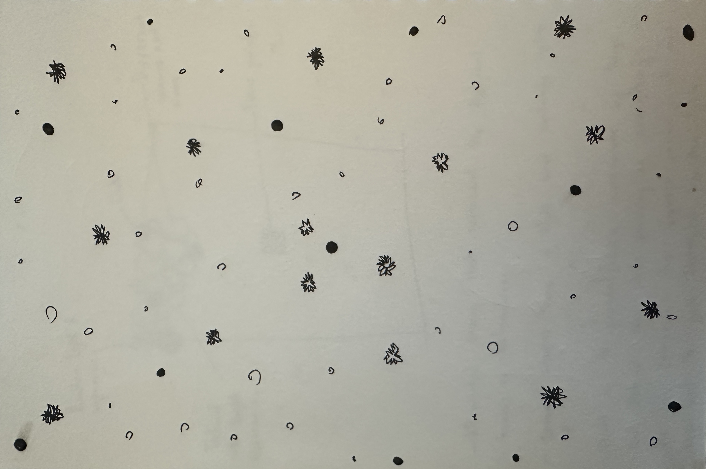
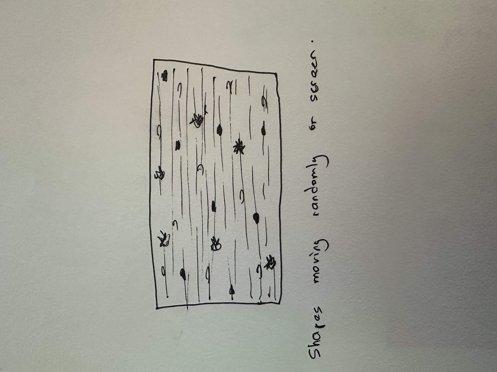
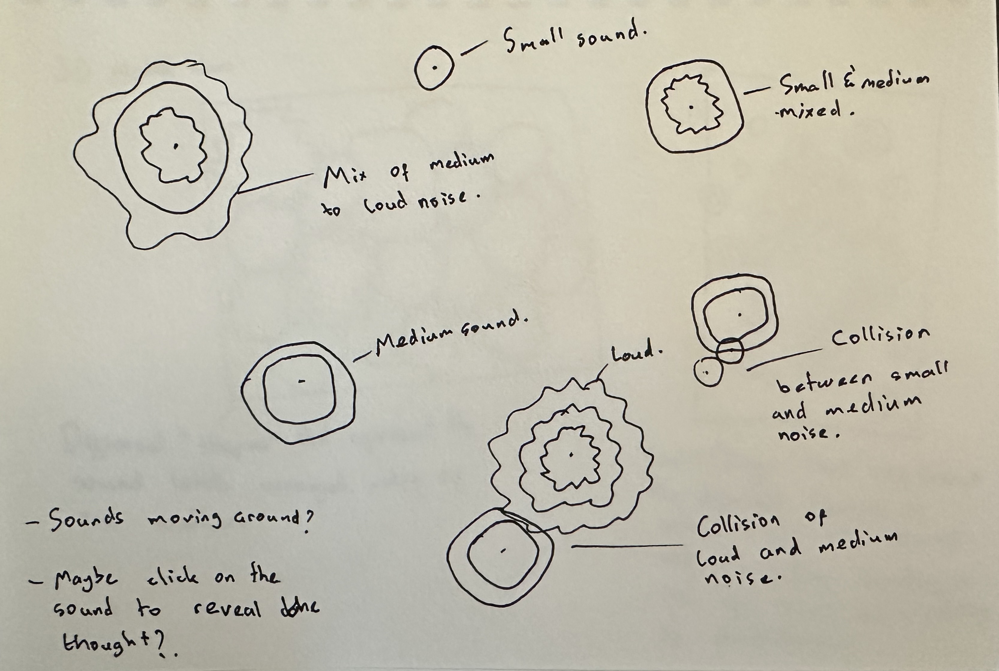
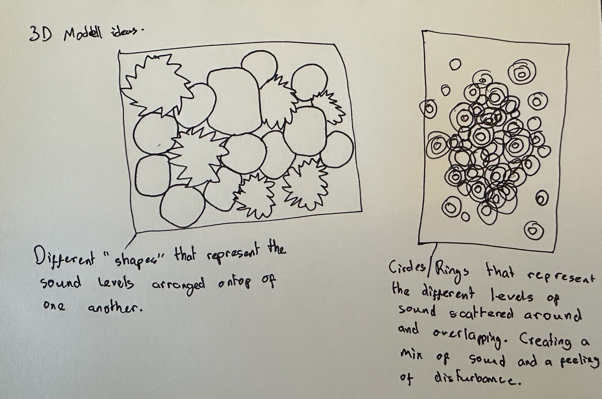

# Week 07

[← Back to Home](../index.md)

## Documentation 

# Week 7 - Making Journal

## 1. Concept Sketches

### Initial sketch

Coming into this week I had a fairly clear visual direction in mind. The sketch showed a dark canvas with 36 sound events drifting across it as organic ring forms. The viewer's mouse acts as the attention point. Hovering near a ring makes it pulse and resonate. Clicking releases a thought phrase that drifts away and fades. No axes, no labels, just the field of rings and the interaction.


### Peer feedback

After leaving responses on other people's work and coming back to my own, I had some post-it notes waiting:

- Is there a different way to visualise this data?
- Is there a different way you can format your data?
- Curious how you think this could be applied for a broader audience.



My first reaction was something like: fair point. I had been so deep in the visual language that I had stopped questioning whether it was actually the best choice, or just the most familiar one to me by now. The feedback helped me step back.

The question about a different way to visualise the data was the most useful one. The rings communicate intensity through size and number, but they do not say anything about time, the quality of the thought response, or what was actually happening when each interruption occurred. There is more in the data that the current format leaves out.

The broader audience question was harder to sit with because the project is intentionally personal. But reading it again, I think there is a real difference between work that is personal in its subject matter and work that is only understandable to the person who made it. I want someone with no background in data design to stand in front of this and feel something about distraction and attention. That should be possible without dumbing it down.


### Revised thinking and sketch

The feedback pushed me in two directions. First, I started thinking about whether the thought field could be more central to the work. Right now the thought phrases appear on click and fade away. But what if language was the main thing, and the visual form supported it rather than the other way around? That would shift the focus from sound intensity to cognitive interruption, which is actually closer to what the project is about.

Second, the broader audience question made me think about format more seriously. A screen-based piece has a limited context. Someone has to sit down and choose to engage with it. A physical object is different. It can exist in a room, be picked up, noticed by accident. That is when I started seriously considering 3D printing as a second output rather than just an idea to shelve.

The revised sketch started to split into two parallel directions: the interactive screen piece and a physical data object. One communicates the experience of distraction as it happens. The other turns the same data into something permanent and tactile. The same week, two very different forms.






## 2. Making Sprint

### What I worked on

I split the 45 minutes between two things: refining the p5.js sketch and starting to sketch out what a 3D printed version of the data could look like.

The most useful decision I made on the p5.js side was stripping out everything that made it look like a chart. Earlier versions still had day labels and a legend. Removing those completely changed how the piece felt. The data is still in there, encoded in the rings, but the viewer has to find it through interaction rather than being told what they are looking at upfront.

For the 3D print direction, I sketched what the data might look like as a physical relief. I landed on a circular disc using a phyllotaxis layout, the same golden angle spiral pattern found in sunflowers. It distributes 36 events evenly across the surface without looking forced or grid-like. Minor events would be single small rings raised from the surface, noticeable events two concentric rings, loud events three rings of increasing height.





### p5.js Development

The full interactive sketch is below. The core idea is 36 entities drifting across a dark canvas using Perlin noise for movement. Each entity is a set of concentric rings whose number and size encode the interruption type. Hovering causes resonance. Clicking releases a thought phrase that travels out along a bezier curve and fades.

```javascript
// ─────────────────────────────────────────────────────────────
//  Interruption Field
//  36 sound events as drifting organic rings
//  Data: sudden sounds & loud vehicles across one week
//
//  Hover  → ring resonates and pulses
//  Click  → releases a thought fragment
//  R key  → rescatter all events
//  C key  → clear thought trails
// ─────────────────────────────────────────────────────────────

const THOUGHTS = [
  "what was that?", "should I check?", "I lost focus",
  "someone outside?", "hard to concentrate", "that was loud",
  "noise again", "where did that come from?", "so distracting",
  "back to work", "lost my train of thought", "again?",
  "I can't focus", "just a car", "probably nothing",
  "that sound...", "OK — refocus", "what?", "should I look?"
];

// 36 events: 14 minor, 12 noticeable, 10 loud
const TYPE_POOL = [
  ...Array(14).fill(0),
  ...Array(12).fill(1),
  ...Array(10).fill(2)
];

let entities = [];
let trails   = [];

function setup() {
  createCanvas(windowWidth, windowHeight);
  textFont("Georgia");
  cursor(CROSS);
  buildEntities();
}

function draw() {
  background(13, 10, 8, 42);

  for (const e of entities) {
    driftEntity(e);
    const prox = constrain(1 - dist(mouseX, mouseY, e.x, e.y) / 130, 0, 1);
    drawEntity(e, prox);
  }

  drawTrails();
  drawUI();
}

function buildEntities() {
  trails = [];
  const types = shuffle([...TYPE_POOL]);

  entities = types.map((t, i) => ({
    t,
    x:   random(width),
    y:   random(height),
    nx:  random(100),
    ny:  random(100),
    spd: [0.35, 0.55, 0.75][t],
    th:  THOUGHTS[i % THOUGHTS.length],
    off: random(TWO_PI),
    pulse: 0,
    rings: buildRings(t)
  }));
}

function buildRings(t) {
  const count = [1, 2, 3][t];
  return Array.from({ length: count }, (_, ri) => ({
    r:        [13, 20, 28][t] + ri * 9,
    wFreq:    [0,  4,  8][t],
    wAmp:     [0,  1.0, 3.2][t],
    wPhase:   random(TWO_PI),
    rotOff:   random(TWO_PI),
    rotSpd:   (random() - 0.5) * 0.0025
  }));
}

function driftEntity(e) {
  const angle = noise(e.nx, e.ny) * TWO_PI * 2;
  e.x += cos(angle) * e.spd;
  e.y += sin(angle) * e.spd;
  e.nx += 0.0022;
  e.ny += 0.0022;

  if (e.x < -40)         e.x = width  + 40;
  if (e.x > width  + 40) e.x = -40;
  if (e.y < -40)         e.y = height + 40;
  if (e.y > height + 40) e.y = -40;

  if (e.pulse > 0) e.pulse *= 0.91;
}

function drawEntity(e, prox) {
  const COLS    = [[210, 202, 182], [196, 146, 28], [184, 54, 34]];
  const BASE_A  = [105, 148, 182];
  const WEIGHTS = [0.7, 1.35, 1.95];

  const c  = COLS[e.t];
  const al = BASE_A[e.t] + prox * 85 + e.pulse * 60;

  for (let ri = e.rings.length - 1; ri >= 0; ri--) {
    const rg = e.rings[ri];
    const breath = 1 + sin(frameCount * 0.016 + e.off + ri * 0.6) * 0.028;
    const R      = rg.r * breath * (1 + prox * 0.14) * (1 + e.pulse * 0.28);
    const rot    = frameCount * rg.rotSpd + rg.rotOff;

    stroke(c[0], c[1], c[2], constrain(al, 0, 255));
    strokeWeight(WEIGHTS[e.t]);
    noFill();

    if (rg.wAmp === 0) {
      circle(e.x, e.y, R * 2);
    } else {
      push();
      translate(e.x, e.y);
      rotate(rot);
      const steps = e.t === 2 ? 88 : 56;
      beginShape();
      for (let a = 0; a <= TWO_PI + 0.05; a += TWO_PI / steps) {
        const r = R + rg.wAmp * sin(a * rg.wFreq + rg.wPhase + frameCount * 0.011);
        vertex(cos(a) * r, sin(a) * r);
      }
      endShape(CLOSE);
      pop();
    }
  }

  noStroke();
  fill(c[0], c[1], c[2], 115 + prox * 110);
  circle(e.x, e.y, 2.8 + prox * 2.5);
}

function drawTrails() {
  for (let i = trails.length - 1; i >= 0; i--) {
    const t = trails[i];
    t.age++;

    const prog = constrain(t.age / 85, 0, 1);
    const al   = constrain(map(t.age, 0, 190, 215, 0), 0, 215);
    const cx   = lerp(t.x, t.ex, prog);
    const cy   = lerp(t.y, t.ey, prog);

    noFill();
    stroke(180, 172, 155, al * 0.5);
    strokeWeight(0.8);
    bezier(t.x, t.y, t.x + 55, t.y - 65, cx - 45, cy + 45, cx, cy);

    noStroke();
    fill(205, 198, 180, al);
    textAlign(LEFT);
    textSize(12);
    textStyle(ITALIC);
    text('"' + t.th + '"', cx + 7, cy);
    textStyle(NORMAL);

    if (t.age > 190) trails.splice(i, 1);
  }
}

function drawUI() {
  noStroke();
  fill(13, 10, 8);
  rect(0, height - 28, width, 28);
  fill(120, 114, 104, 140);
  textAlign(LEFT);
  textSize(9);
  textStyle(ITALIC);
  text("36 interruptions — hover to resonate · click to release thought · R reset · C clear", 18, height - 11);
  textStyle(NORMAL);

  fill(13, 10, 8);
  rect(0, 0, width, 26);
  fill(162, 155, 140, 145);
  textAlign(CENTER);
  textSize(10);
  textStyle(ITALIC);
  text("sudden sounds & loud vehicles — one week of interrupted attention", width / 2, 16);
  textStyle(NORMAL);
}

function mousePressed() {
  for (const e of entities) {
    if (dist(mouseX, mouseY, e.x, e.y) < 32) {
      trails.push({
        x: e.x, y: e.y,
        th: e.th, age: 0,
        ex: e.x + random(-195, 195),
        ey: e.y + random(-115, 95)
      });
      e.pulse = 1;
      break;
    }
  }
}

function keyPressed() {
  if (key === "r" || key === "R") buildEntities();
  if (key === "c" || key === "C") trails = [];
}

function windowResized() {
  resizeCanvas(windowWidth, windowHeight);
}
```


A few decisions worth noting. The Perlin noise drift was important to get right. Using `noise(e.nx, e.ny) * TWO_PI * 2` gives each entity a direction that changes smoothly over time rather than randomly. The `nx` and `ny` values increment each frame, which moves the entity along the noise field and produces organic curved paths.

The background alpha of 42 was found by trial and error. Lower values leave trails that linger too long; higher values clear too quickly and the sense of motion disappears. 42 sits in a zone where the trails are brief but visible, like residue rather than smear.

The three ring types use different visual treatments. Minor events are clean circles. Noticeable events have a gentle sine-wave distortion applied to the radius. Loud events have a more pronounced distortion at a higher frequency, so they read as irregular and spiky. The visual character of each ring reflects how the sound actually felt.

### 3D Print Exploration
 
The peer feedback about broader audience and different formats pushed me toward thinking about a physical output. The idea was a circular disc where each interruption event is a raised ring form on the surface, using the same visual language as the digital piece but frozen into something you can hold.
 
For the layout I used phyllotaxis, the golden angle spiral that distributes seeds in a sunflower. It places 36 points evenly across a circular area without any visible grid or pattern, which matches the organic feel of the digital piece.
 
I used Blender to build the model, writing a Python script through vibe coding that generates the full geometry automatically. Blender has a Scripting workspace where you can write and run Python directly against the 3D scene, so rather than placing each of the 36 ring forms by hand, the script calculates every position using the same phyllotaxis formula as the p5.js sketch and builds the entire model in one run.
 
The script works in four steps. First it creates the base disc as a cylinder. Then it generates all 36 ring forms as torus objects positioned at their calculated coordinates. After that it joins all the rings into a single mesh and uses a boolean intersection to clip any rings that extend beyond the inner wall, which stops them from poking through the rim. Finally it builds the hollow rim and joins everything into one clean object ready for export.
 
```python
# Phyllotaxis position calculation - same formula as p5.js
def get_pos(i):
    r = math.sqrt((i + 0.5) / N) * SPREAD_RADIUS
    a = math.radians(i * GOLDEN_DEG)
    return r * math.cos(a), r * math.sin(a)
 
# Type assignment - same logic as p5.js so both outputs encode consistently
def get_type(i):
    t = (i * 7 + int(i * 2.618033)) % 10
    return 0 if t < 4 else (1 if t < 7 else 2)
```
 
Minor events get one ring, noticeable get two concentric rings, loud events get three rings of increasing radius and height. The type assignment formula is identical to the one in the p5.js sketch, so the same event that appears as a triple ring on the canvas appears as a triple ring raised from the disc.

 

 *3D Blender Rings Visualisation*

One issue that came up early was rings near the edge of the disc extending beyond the rim wall. The boolean intersection step clips everything cleanly to the inner radius before the rim is added, so the final object has no geometry poking through the walls.
 
Export from Blender is File > Export > STL, with Scene Unit ticked in the export panel so the dimensions come out in millimetres. That file then goes into a slicer for print preparation.
 
 
*3D Print file in Cura, Sliced and ready for print*

### Reflection on the sprint

This session was a turning point. Before it, the project was a screen-based digital piece and that was the end of it. The peer feedback and the sprint pushed me to see that the same data could exist in more than one form, and that having both might actually make the concept stronger rather than spreading it thin.

The digital piece communicates the experience of distraction in real time. The physical piece communicates the record of distraction. One is felt in the moment; the other is held afterwards. That distinction now feels like it matters.


## 3. 'What If' Variations

### Partner's suggestions

After walking my partner through the sprint outcomes, they came back with three directions to consider:

**What if the data was experienced as sound?** Each interruption type could trigger a different audio tone when the viewer moves near it. Minor events a low soft hum, noticeable events a warmer mid tone, loud events something sharper and more sudden. Moving across the canvas would generate a kind of ambient score made from the week's interruptions.

**What if the viewer's own attention was tracked in real time?** Instead of replaying collected data, the piece could watch how the viewer's mouse moves, where it dwells, and what it gets drawn to. It would generate a live visualisation of the viewer's own distraction, turning the experience back on them.

**What if the data was worn?** The 36 events could be encoded into a small wearable object, a pendant or tile, where the pattern of raised rings represents the week. The data would be carried on the body rather than displayed on a wall or screen.


### The direction I chose: adding sound

I went with the first one. The project is literally about sound interrupting attention, but the current piece is completely silent. That is a contradiction worth fixing.

If hovering near an event triggers a tone that matches its type, the piece starts to reconstruct the sonic environment it is documenting. Moving the mouse across the canvas would produce a quiet, layered sound made from the interruptions themselves. Someone who never reads the title or engages with the visual system would still feel the difference between a quiet day and a busy one, just from the density of sound generated as they explore.

This also answers the broader audience question from the peer feedback. Sound is more immediate than a visual system. You do not need to know anything about data design to respond to it.

To build this I would use the p5.sound library. Three short audio files, one per type, triggered by proximity. Volume scales with how close the cursor is. When someone clicks a ring, the actual voice recording of that thought plays. That would shift the piece from displaying data to replaying a real moment.


### What this opens up

Adding sound keeps the piece in the screen-based format while making it significantly more affecting. The voice recordings in particular feel important. Hearing a real person say "I lost focus" or "what was that?" is more direct than reading the same phrase in italic text on a screen.

The wearable idea my partner suggested also stayed with me. I am not pursuing it right now, but it connects to the 3D print direction I am already exploring. A disc you hold in your hand and run your fingers across is not that far from something worn on the body. Both make the data intimate in a way a screen cannot.

From here the project has two confirmed outputs: the interactive p5.js piece and the 3D printed data object. Sound integration is the next development to work toward on the digital side.