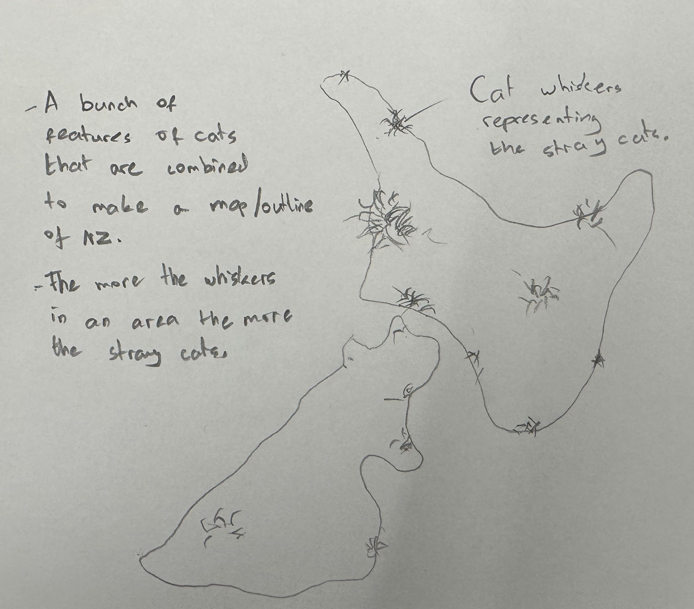
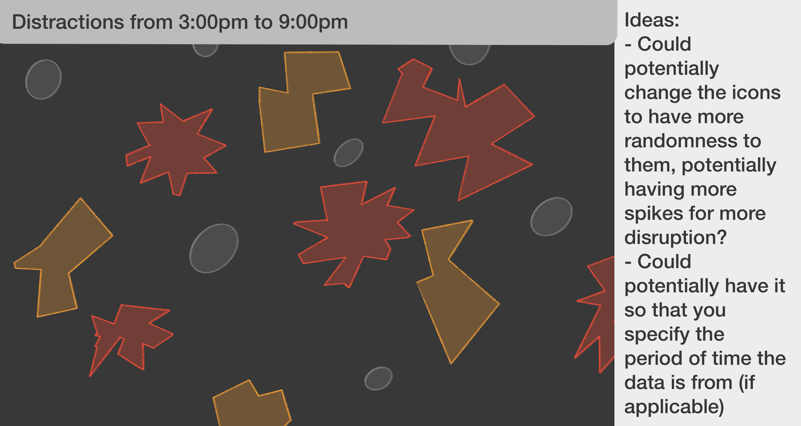
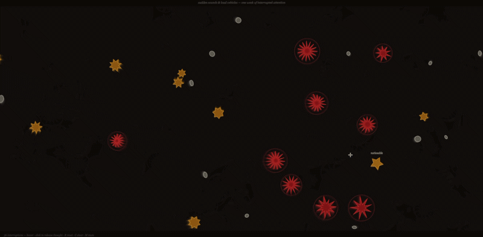

# Week 08

[← Back to Home](../index.md)

## Documentation 

# Week 8 - Making Journal

## Progress Report
 
This week opened with a progress report where I presented my work to the class. I walked through the two main threads of the project: the interactive p5.js sketch and the 3D model development in Blender.

For the p5.js side, I showed the sketch running live. The core behaviour at this point was 36 interruption events drifting across a dark canvas using Perlin noise, each one represented as a ring form whose complexity depended on its type. Minor events appear as a single small circle. Noticeable events have two concentric rings. Loud events have three, with a wavy distortion applied to the outer rings to make them feel more unsettled. Hovering near any event causes it to pulse and grow slightly, as though it is responding to proximity. Clicking releases a thought phrase that travels outward along a bezier curve and fades over a few seconds.

I explained the data behind the sketch: 36 events recorded across seven days using tally marks, split into three intensity categories based on personal perception rather than any objective measurement. I also talked about why I had removed the day labels and axes from earlier versions, and how that decision shifted the piece from feeling like a chart to feeling like an environment. The removal of structure was intentional. I wanted the data to be felt rather than read.

For the 3D model, I presented the Blender Python scripting approach and the clinical specimen direction. The object is a petri dish-style circular disc, 110mm in diameter, with 36 ring forms distributed across its surface using a phyllotaxis layout. I explained the reasoning behind the form: the object is meant to look like something a monitoring system produced about a person, not like something a designer crafted. The matte white material and the hollow rim reinforce that clinical quality. I also showed the specimen label card that sits alongside the object, with fields like "Subject: Redacted", "Events recorded: 36", and "Classification: High interruption frequency". That label does a significant amount of the conceptual work. Without it, the disc is just a disc. With it, the disc becomes a record.

## Feedback Received

The feedback from the progress report gave me a lot to think about, and most of it pointed in the same direction even when it came from different angles.

The most consistent observation was about the p5.js sketch: the events felt too orderly. When the piece is running, the rings drift smoothly and steadily. They move at speeds that are predictable based on their type, they behave consistently over time, and the overall visual impression is calm. Several people noted that it felt quite pleasant to watch, almost meditative. On one level that sounds like a compliment, but in the context of this project it is actually a problem. The proposal is a critique of surveillance and datafication. A piece about the chaos and unpredictability of distraction should not feel soothing.

The specific suggestion was to introduce more randomness into the movement and appearance of the icons. This could mean varying speeds more significantly within each type, introducing occasional sharp changes in direction rather than smooth curves only, allowing some events to be larger or smaller than others even within the same category. The underlying idea is that interruptions are not consistent or predictable in real life, and the visual system should reflect that.

There was also a question about the colour palette and whether it was doing enough work. The current colours, warm cream for minor events, amber for noticeable, and coral for loud, read as considered and intentional. They are design choices. The suggestion was to think about whether a slightly more unsettling palette might better serve the concept, or at least whether the warmth of the current colours was working against the critical tone of the proposal.

Another point raised was about the click interaction. At the moment, clicking an event always does the same thing: a thought phrase drifts out and fades. The feedback asked whether the interaction could be more surprising, whether the response could vary in a way the viewer could not fully anticipate. The idea is that predictable interaction teaches the viewer to expect a certain outcome, which reduces the sense of disruption. If the piece is about distraction, the viewer should not always know what is coming next.

Finally, there was a broader question about the relationship between the two outputs. A viewer encountering the project in a showcase might not immediately understand that the p5.js piece and the 3D disc are encoding the same 36 events. This is worth thinking about in terms of how they are displayed together and whether there is any text or framing that makes the connection explicit without over-explaining it.

## Briefing Session

After the progress reports, we moved into a briefing session where new partners were introduced. The format involved everyone talking through their projects and the feedback they had just received, which was useful for a couple of reasons. First, it forced another round of articulating the project in a short amount of time to someone who had not seen it before. Second, hearing other people describe their own feedback created a kind of shared vocabulary around the common challenges people were encountering, things like legibility, audience access, and the gap between a designer's intention and what a viewer actually experiences.

Meeting my new partner and hearing their project for the first time was interesting. The project was regarging stray cats around New Zealand. We talked through what they were working on, what the core concept was, and what the feedback from their own progress report had focused on. From there we started to think together about what directions their project could go and what choices were still open.

## Design Proposition for Partner

Based on the briefing conversation, I put together a short design proposition for my partner's project.

My partner's project deals with stray cats in New Zealand. After hearing about it and thinking about the feedback they had received, the direction I proposed was focused on the data driven visualisation.

The challenge I kept returning to while working on this was the same one that had come up in my own progress report: the gap between what a piece is trying to say and what a viewer actually experiences when they encounter it. A concept can be strong and clear on paper and still fail to land if the visual or interactive form does not carry it effectively. My proposition for my partner was trying to address that gap in their specific case, thinking about what the experience of their piece actually feels like for someone coming to it cold and whether the form is doing the conceptual work or leaving it all to the text and framing.

*Data Driven Visualisation concept I sketched for my partner.*

Working on someone else's project for an hour was a good exercise. It required a different kind of critical thinking than working on my own piece, partly because I had no emotional attachment to the decisions that had already been made. I could look at it more directly and ask whether things were working without worrying about what it had cost to make them.

## Design Proposition Received from Partner
 
In return, my partner developed a design proposition for my project. What they put together was genuinely useful and directly addressed some of the same issues that had come up in the progress report feedback.
 
They created a visual sketch showing an alternative version of the p5.js canvas, titled "Distractions from 3:00pm to 9:00pm". Rather than using the ring forms I had developed, they explored a different visual language for the events: a mix of spiky star shapes with varying numbers of points, angular arrow-like forms in different sizes and orientations, and simple ovals. All of these sat on the same dark background as the current piece, rendered in warm reds, oranges, and deep amber tones. The overall impression was much more chaotic and less predictable than the current sketch. Things were oriented in different directions, overlapped, and varied significantly in scale.
 

 *Visualisation suggestion from my partner.*

Two specific ideas came with the sketch. The first was about the shapes themselves: they suggested changing the icons to have more randomness, including more spikes for a greater sense of disruption. The current ring forms are relatively calm in shape even when they are meant to represent loud events. A spikier, more angular visual language would make the disruption more legible at a glance, and would make the three types feel more distinct from each other rather than all being variations of the same circular form.
 
The second idea was about time: they proposed the option to specify the period of the day the data is from, using the example of 3:00pm to 9:00pm. This is interesting because it suggests that the visualisation could become more granular. Rather than showing a whole week as one undifferentiated field, a viewer could zoom into a specific window of time and see only the events from that period. This would let someone compare a morning to an afternoon, or a weekday to a weekend, and make patterns in the data visible that are currently flattened by the week-level view.
 
Both of these suggestions reinforced the progress report feedback and gave it more visual specificity. The shape suggestion in particular is something I want to carry forward. The ring language made sense early in the project because it echoed the concentric forms from the hand-drawn data drawing, but at this stage of development it might be worth asking whether that continuity is more important than having a visual that better communicates the feeling of interruption. A spiky, angular form reads as disruptive in a way that a circle does not, regardless of what label is attached to it.
 
The time period idea is worth keeping in mind too, although it would require structuring the data differently. At the moment the 36 events are a flat list without timestamps. Adding timestamps would allow filtering by time window, which would make the piece more data-driven in a legible way and potentially more useful for exploring patterns rather than just communicating a general feeling.

## Independent Study - Reflective Summary

During the independent study period I wrote a reflective summary of the project as a whole, trying to get some distance from the day-to-day making and think about where things actually stand.

The core concept is still solid. The project is about questioning how data systems reduce complex, subjective human experience into clean, legible metrics. The specific subject is attention and interruption, and the data is personal and self-collected, which ties it clearly to ideas from data humanism. The subjectivity of the intensity categories, the gaps in the recording where sounds went uncaptured, the thought responses that resist quantification, all of these are features of the project rather than limitations. They are evidence of the argument the work is making.

What the feedback this week made clear is that the execution of the p5.js piece is not yet fully aligned with that concept. A piece about the messy, unpredictable nature of distraction needs to feel at least somewhat unpredictable. At the moment it feels like a well-managed system, which is almost exactly what the project is arguing against. There is something ironic about that which is worth sitting with. The piece is critiquing the idea of attention being reduced to orderly, trackable data, and yet the visual is quite orderly and trackable. That needs to change.

The 3D print direction is conceptually stronger at this stage. The clinical specimen aesthetic is working. The object looks institutional rather than artistic, the specimen label reframes it as a record rather than a sculpture, and the fact that it is generated by a script rather than modelled by hand reinforces the idea of a system producing a document about a person. When someone picks it up, they are not holding a piece of art. They are holding a data artefact. That is the right feeling.

The challenge with the 3D object is that it is static. It makes a strong argument but it does not involve the viewer in the same way the digital piece does. Someone can look at it, read the label, and understand the point. But they cannot do anything with it. There is no way in. The p5.js piece, when it is working well, pulls the viewer into the data in a way that changes how they experience the concept. That is worth fighting for.

The two outputs also need to be clearly understood as two versions of the same thing. The digital piece is the experience of 36 interruptions happening over time. The physical object is the record that a system might generate from those same 36 events. The contrast between those two versions of the data is central to the argument. If a viewer encounters both without understanding that connection, the project loses something important.

Reflecting on the process so far, one of the more useful realisations from this week is that the feedback about randomness and unpredictability is not just a visual note. It is a conceptual note about whether the piece is embodying its own argument. That is a useful distinction. A visual note says "this looks too uniform." A conceptual note says "this piece is saying one thing and doing another." The second kind of note requires a more fundamental response, and that is what I need to work on.

## Continued Development - p5.js Focus

Given the feedback, I decided to focus this week's independent development time on the p5.js sketch rather than continuing to iterate on the 3D model. The 3D direction is solid enough to leave alone for now. The p5.js piece needs more attention.

The starting point was the randomness feedback. I wanted to think carefully about what kind of randomness would actually serve the concept rather than just adding visual noise for its own sake. There is a difference between making something look random and making something feel genuinely unpredictable in a way that communicates something. The goal was the second kind.

**Speed and drift variation**

The first change was to the speed distribution within each entity type. Previously, each type had a fixed base speed with only minor variation. Minor events drifted at around 0.35 units per frame, noticeable at 0.55, loud at 0.75. The speeds were legible and predictable, which was part of what made the piece feel too orderly.

I changed this so that the speed for each entity is drawn from a wider range within its type, with occasional outliers. A minor event might drift at 0.2 or at 0.6. A loud event might be slower than a noticeable one. This breaks the visual hierarchy of the field in a way that feels more honest to the subject matter. Real interruptions do not arrive at predictable intervals in predictable order.

**Drift behaviour**

The Perlin noise parameters that control direction now vary more significantly between entities. Previously, most entities moved in long, gentle arcs that made the field feel like a flock moving together. I adjusted the noise increment values so that some entities change direction much more sharply and frequently, while others still drift slowly and smoothly. The result is a field that feels less like a choreographed system and more like independent events happening without awareness of each other.

**Size jitter on generation**

Within each type, the ring radii are now varied slightly when the entities are built. Two minor events sitting next to each other will look similar but not identical. One might have a slightly larger outer ring, or a slightly thicker tube. This is a subtle change but it makes the field feel less like a repeating pattern and more like individual marks.

**Variable thought responses on click**

I started working on making the click interaction less predictable. Instead of every click always producing a thought phrase that travels to a random position and fades over the same duration, different events now have different response behaviours. Some release the thought quickly and it fades fast. Others release it slowly and it lingers longer on screen. A small number do something different: the thought text appears briefly and then disappears suddenly, as though the thought was lost before it could fully form. That last behaviour is the one I am most interested in developing further. It feels closest to how distraction actually works.

**Burst behaviour**

I also began testing a behaviour where clicking an entity causes nearby entities to briefly accelerate before settling back into their normal drift. The idea is that one interruption triggering a chain reaction of smaller ones reflects something true about how distraction works. When your attention is pulled away once, it is harder to anchor it again, and smaller things that you might normally ignore become more distracting. The burst behaviour is not fully resolved yet but the early tests are promising.

*Updated p5.js sketch*

The overall effect of these changes is that the field now feels more alive and less predictable. It is harder to watch it passively. Things happen that you do not expect. That is much closer to where the piece needs to be.

## Vibe Coding the Updated Sketch
 
To implement the week 8 changes, I used vibe coding as part of my development workflow. Rather than writing every line from scratch, I worked with Anthropic's (2026) Claude to generate and refine the code, using my own understanding of what needed to change conceptually and then prompting it to translate that into working p5.js.
 
The process started with describing the problem clearly. I explained that the current sketch had all three entity types moving at predictable, fixed speeds and that the shapes were too uniform and calm for a piece about distraction. I described the five changes I wanted to make: wider speed ranges within each type, variable Perlin noise increments per entity, spikier and more varied shape forms based on the partner's design proposition, three different click response behaviours, and a burst effect when entities are clicked.
 
Working with Anthropic's (2026) Claude on this was different from simply asking it to write a sketch from scratch. Because I already had a working version of the code and a specific set of changes in mind, the conversation was much more targeted. I could describe exactly what each change was meant to achieve conceptually and then ask for the implementation. For example, when describing the shape redesign, I referenced the partner's sketch showing spiky stars, angular forms, and irregular ovals, and explained that the current ring language was too calm and geometric. Anthropic's (2026) Claude proposed using a noise-driven spiky shape function rather than a random one, which was a better solution than what I had been thinking about because it avoids the flickering that would come from calling random() every frame inside a shape. That was something I learned from the process rather than something I arrived at myself.
 
The burst behaviour was another case where the vibe coding workflow produced a solution I would not have coded the same way alone. I described the behaviour I wanted: clicking an entity should cause nearby entities to briefly accelerate and then decay back to their normal speed. Anthropic's (2026) Claude implemented this using a burstMult property on each entity that gets set by a triggerBurst() function and then decays multiplicatively each frame. That decay approach means the burst fades smoothly rather than stopping abruptly, which matches the way distraction chains actually work in practice.
 
What the vibe coding process requires is genuine understanding of what the code is doing. At several points I had to read through Anthropic's (2026) Claude's output carefully and adjust things that were technically correct but did not match the intended behaviour. The original implementation of the vanish response type, for example, cut the thought trail off at a fixed frame number rather than at a percentage of each entity's maximum age. That meant all vanish-type thoughts disappeared at the same moment regardless of their individual timing, which undermined the variation I was trying to create. Fixing that required understanding the logic well enough to spot the issue and know what to change.
 
The updated sketch would have taken significantly longer to build without Anthropic's (2026) Claude. At the same time, the decisions about what to change, why those changes matter conceptually, and whether the result is working the way it should were all made through my own judgment. Claude handled a lot of the implementation. The design thinking behind it was mine.

## Referece 

Anthropic. (2026). Claude (Sonnet 4.6) [Large language model]. https://claude.ai
