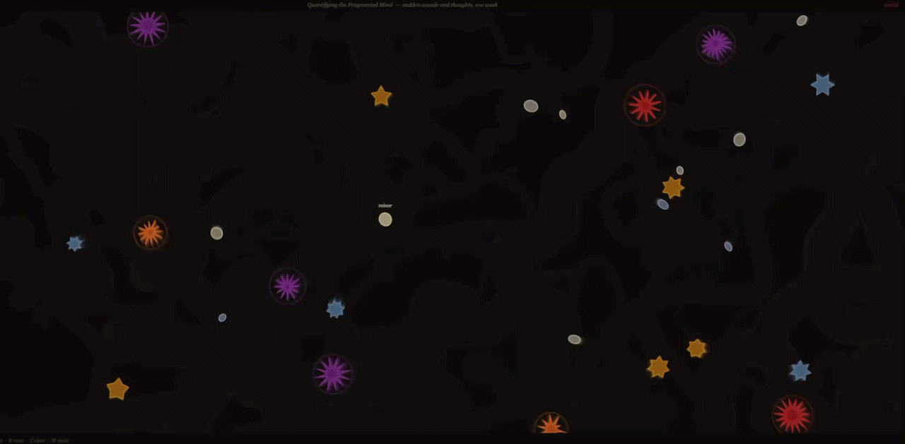

# Week 10

[← Back to Home](../index.md)

## Documentation 

# Week 10 - Making Journal

## Gamified Critique Session

Week ten was a critique session with a different format to previous weeks. Rather than structured presentations or one-on-one peer feedback, the class ran a gamified critique designed and facilitated by Tian Mai using Padlet as the feedback platform.

The session was structured in six segments across roughly three hours: setup and personal reflection, a comment time block, a break, core critique, a gallery walk for cross-group feedback, and a final action plan and wrap-up. The gamification rationale was grounded in three frameworks. Self-Determination Theory, which supports autonomy and competence through structured roles and clear goals. Cognitive Load Theory, which uses templates and time limits to reduce mental overhead and keep attention focused on what matters. And Flow Theory, which aims to match challenge to skill level so the experience feels neither boring nor overwhelming.

In practice this meant each group worked on a shared Padlet board using a Collaborative Feedback Matrix template. Feedback was left as sticky notes across columns rather than spoken aloud, which changed the dynamic noticeably. Writing feedback for someone you do not know forces a different kind of precision than talking through it. You cannot rely on tone or body language to soften something or add nuance, so what you write has to be clear and considered.

After the session we completed a post-session survey measuring three things: flow experience (whether the task felt absorbing and fluid), affect using the PANAS scale (positive and negative emotional states during the session), and cognitive workload using the NASA-TLX scale (mental demand, time pressure, frustration, and effort). The survey data was part of research into whether gamification improves the critique experience as a learning environment.

## Feedback Received

### Conceptual Feedback

The conceptual feedback I received was: the data and how it is presented does encourage the viewer to think about their own reactions and thoughts to distractions and noise. However, the critical idea behind the project is still not very clear.

This is consistent with what came out of the week nine project statement evaluation. The subject matter is landing. People understand what the piece is about and they engage with the idea. But the argument, what the piece is actually trying to say or challenge, is not coming through clearly enough. There is a difference between a work that makes someone think about distraction and a work that makes a specific critical claim about distraction. The piece is currently doing the first thing but not yet the second.

What that tells me is that the statement and the work itself still need to be more focused in their framing. Saying that distraction is personal and subjective is interesting. Saying that systems which try to quantify and optimise distraction miss the point because the experience is personal and subjective is an argument. The piece needs to be making the second kind of claim, not just illustrating the first.

### Technical Feedback

The technical feedback noted that the data and tools are already relevant to the project and the data portrait is feasible within the remaining timeline. That is reassuring and confirms there is nothing structurally wrong with the direction.

The one challenge flagged was the gaps in the data. Some of the data points used in the sketch are AI-generated rather than self-collected. The suggestion was direct: with two weeks still remaining before the end of the assignment, collect another couple of days of real data so that the AI-generated content is not needed. The point is that using AI-generated data in a project arguing for the irreplaceable value of personal, subjective, human experience is a contradiction that undermines the concept.

This is a fair point. The project's whole argument rests on the idea that this data is mine, that these events are real moments from a real week, and that the gaps and inconsistencies in the recording are meaningful evidence of distraction rather than errors. If some of those events are simulated, the foundation of that argument weakens. Collecting two more days of genuine data is both achievable and the right call.

### Summary from the Discussion

The summary note captured what the piece communicates at a basic level: a screen-based visualisation that lets users move their mouse to see and hear different sounds and thoughts collected throughout the course of the project. The sounds are based on different noises that get heard and cause distraction, and the thoughts are what was experienced when each sound occurred. The size and ring count of each form correlates to how loud the sound was.

Reading that back, it is accurate as a description of what the piece does, but it is purely descriptive. It does not say anything about why any of that matters or what it is arguing. That gap between description and argument is exactly the conceptual clarity problem the first piece of feedback identified. The piece can be fully functional and still fail to communicate its critical point if the framing is not right.

### Critical Thinking

Two questions came out of the discussion that I want to sit with.

The first: what is the end goal of this project? Do you want to reinforce that distraction is bad, or that we should give time to let our minds wander?

That is a genuinely interesting distinction I had not made explicit in my own thinking. The piece, as it currently stands, could support either reading. The dark canvas and unsettled movement of the entities could read as anxiety-inducing, with distraction as something negative, fragmenting, and disruptive. Or it could read as meditative and generative, the mind exploring rather than failing. The sounds and thought fragments lean toward the first reading with phrases like "I lost focus" and "I can't concentrate," but the overall visual aesthetic is not clearly aligned with either.

I need to decide which of these the project is actually arguing and make sure the visual language is supporting that argument rather than leaving it ambiguous. Given the speculative future scenario in the proposal, a system that monitors and optimises attention, the more powerful argument is probably the second one. The piece should push back against the idea that mind-wandering is a problem to be fixed. Distraction is not always failure. Sometimes the mind needs to drift. A system that treats all distraction as a productivity deficit misunderstands what it means to be human. That is a much sharper critical claim than simply observing that distraction happens to everyone.

The second question: how could you convey emotion in the coding? Colour?

This connects directly to the first question. If the project commits to a position on mind-wandering versus distraction as failure, colour becomes a way to communicate that emotionally rather than just informationally. The current palette uses cream, amber, and coral to distinguish minor, noticeable, and loud events. That encodes intensity but not feeling. A warm amber event and a cool blue event might encode the same intensity level but communicate very different emotional qualities.

One direction worth exploring: map colour to the emotional tone of the thought fragment rather than just the loudness of the sound. A thought like "I lost focus" and a thought like "it's gone now" might both come from a loud event, but one is anxious and one is resigned. If colour tracked that distinction, the canvas would start to tell a more nuanced emotional story rather than just a volumetric one.

## Reflection on the Critique

The gamified format worked better than I expected. Having written feedback rather than spoken feedback made the experience less pressured, and the Padlet matrix structure meant people were already thinking in terms of conceptual, technical, and critical categories when they wrote their notes. The feedback I received was specific enough to act on, which is not always the case with verbal critique.

The two questions at the end of the feedback were the most generative part. "What is your end goal?" is not a criticism but it is a challenge, and it is the right challenge at this stage of the project. Week ten sits two weeks from the showcase. There is not much time left to make fundamental changes, but there is enough time to sharpen the argument and make one or two significant decisions about colour and framing. Those decisions need to happen now.

.png>)

## Continued Development

After the critique session I went away and started working through the action points that came out of the feedback.

### Collecting More Data

The most immediate task was replacing the AI-generated data points with real ones. I started carrying a notebook again and recording interruption events across two additional days, using the same system as the original collection period. Tally marks in real time, with a note of the thought or internal response at the moment of each interruption. By the end of those two days I had enough genuine events to replace the simulated data and bring the total back to a credible set of self-collected observations.

Having the data feel genuinely mine matters more than the number of events in it. The whole argument of the project is that this kind of personal, subjective, imperfect data has a value that clean machine-generated data does not. Replacing the simulated points with real ones makes that argument consistent with the actual dataset rather than just the framing around it.

### Exploring Colour as an Emotional Layer

The question about conveying emotion through colour was something I could start prototyping quickly. The current colour system maps directly to intensity: cream for minor events, amber for noticeable, coral for loud. That is legible but flat. It tells you how loud something was, not how it felt.

I started sketching out a different approach where colour shifts within each type based on the emotional quality of the associated thought. Thoughts that reflect anxiety or loss of focus, like "I can't concentrate" or "I lost my train of thought," would pull the colour of that entity toward cooler, more unsettled tones. Thoughts that are more curious or observational, like "what was that?" or "where did that come from?", would sit in a warmer, more neutral range. Thoughts that reflect recovery, like "back to work" or "OK, refocus", would pull toward something slightly different again, something that reads as more settled.

This is still being worked through. The challenge is that each entity already has a fixed type and a fixed thought phrase, so the colour would need to be derived from the thought content at the point of building the entities rather than being a separate system. I have not implemented this yet but I have been testing what different palettes feel like on the canvas and the difference in emotional quality is noticeable even with rough testing.

### Refining the Critical Framing

The biggest shift from the week ten critique was committing to a clearer position on what the project is actually arguing. After sitting with the question about end goal, I landed on this: the project is not saying distraction is bad. It is saying that the experience of being distracted is too complex and too personal to be captured meaningfully by a monitoring system. The piece is a record of what distraction actually feels like from the inside, and placing that record in a speculative future where such systems exist is the critical move. The argument is that the system would miss most of what is in the piece.

That framing changes some small things about the project statement and the way I talk about the work. It also changes what the piece is trying to do to a viewer. Rather than making them feel the discomfort of surveillance, it should make them feel the richness of the experience that surveillance cannot touch. That is a more interesting provocation and it gives the work somewhere to go beyond pointing at a problem.

I updated the project statement draft to reflect this shift, tightening the language around the critical engagement and removing some of the over-explaining from the ending. The new version is closer to what the piece is actually doing.

